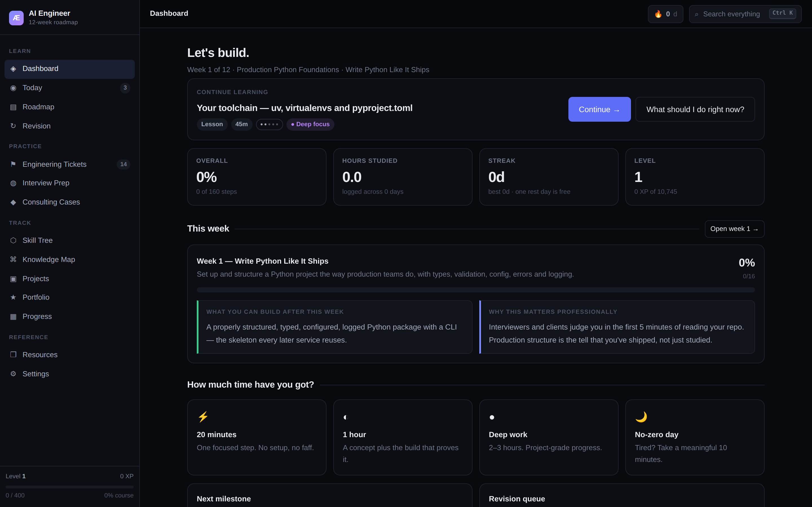
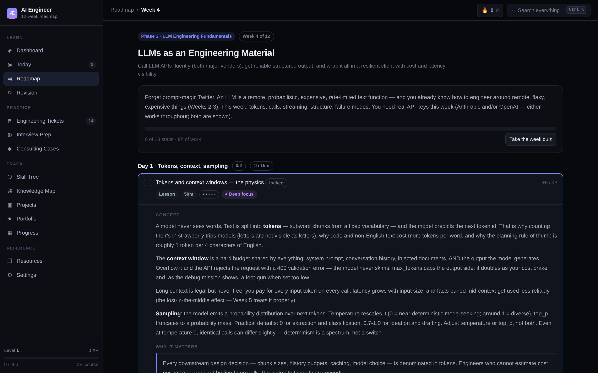
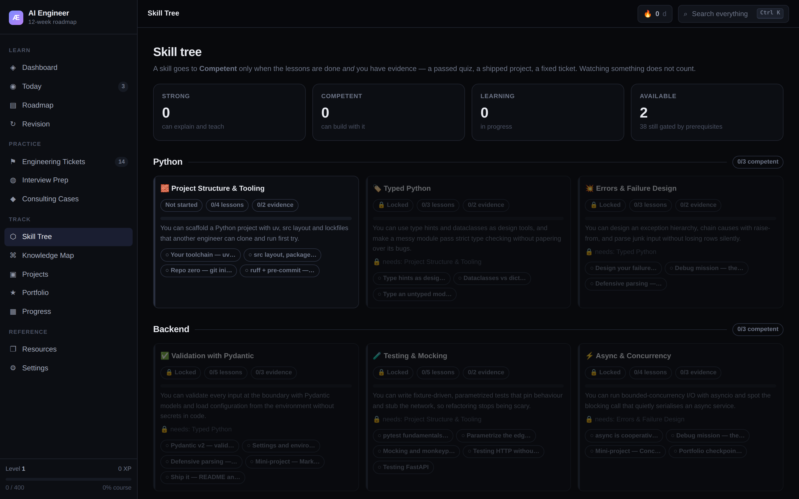

# AI Engineer Roadmap

A twelve-week, project-based curriculum for becoming a production-capable AI engineer — and the
app that runs it. It is not a link dump. Every week has a build, a debug mission, a quiz with a
pass mark, and a project you can put in front of an interviewer. Your progress, notes, confidence
ratings and spaced-repetition schedule live in the browser and go with you.

**Live:** https://mrfury0.github.io/ai-engineer-roadmap-app/



<details>
<summary>More screenshots</summary>





</details>

A single-page React + TypeScript app with no backend, no accounts and no tracking. It builds to
static files and deploys to GitHub Pages.

## What's inside

| Content | Count |
| --- | --- |
| Weeks | 12 |
| Days | 84 |
| Steps (lessons, builds, projects, reviews) | 163 |
| Estimated study time | ~117 hours |
| Debug missions | 96 |
| Quizzes | 12 (87 questions) |
| Engineering tickets | 14 |
| Interview questions | 72 |
| Flashcards | 60 |
| Consulting cases | 5 |
| Portfolio projects | 10 |
| Tracked skills | 40 |
| External resources | 115 (111 verified on 6 Sep 2026) |

Progress is more than a set of ticks. Each step carries a difficulty, an energy level and a pace
tag, so the planner can fill a twenty-minute gap or a three-hour block with work you are actually
able to do next. Lessons you mark confusing, or rate 2 or below on confidence, drop into a
spaced-repetition queue on a 1/3/7/16/35-day ladder.

## Running it locally

```bash
npm install
npm run dev      # Vite dev server on http://localhost:5173
npm test         # Vitest, jsdom
npm run build    # typecheck + production build into dist/
```

Node 20 or newer.

## Architecture

The interesting decisions, and why they were made that way:

**Content is typed JSON, asserted once at the data boundary.** The whole curriculum lives in
`src/data/*.json` and is cast into the domain types in `src/data/index.ts` — the single place a
cast happens. Downstream, everything is fully typed, so renaming a field in `src/types.ts` surfaces
every view that reads it. Flat lookup indices (`itemById`, `weekOfItem`, `dayOfItem`, …) are built
once at module load rather than re-scanned per render.

**The rules are pure functions, kept out of React.** `src/lib/selectors.ts` holds every rule the app
enforces — what counts as in-pace, when a week unlocks, what the next best task is, whether a skill
has earned "Competent" — as pure functions from `(Progress, content) → answer`. None of them import
React. That is what makes them unit-testable, and it is why the interesting tests in this repo are
plain function calls rather than rendered components.

**Progress is a reducer-ish context.** `ProgressContext` owns one `Progress` object and exposes
named domain actions (`toggleItemDone`, `gradeFlash`, `recordQuiz`, …) rather than a raw setter, so
every state transition has one name and one implementation. Writes are debounced before they hit
storage.

**Hash routing.** Routes are `#roadmap/w4`, not `/roadmap/w4`. It costs a little elegance in the URL
and buys deployment as pure static files: no server rewrites, no 404 fallback, no configuration on
GitHub Pages beyond turning it on.

**localStorage with export/import, not a backend.** There is no account to create and nothing to
leak, because there is no server. Moving between machines is an explicit export and import of a
JSON file. Storage that throws — private mode, disabled site data — degrades to an in-memory
session with a warning rather than a crash.

**A hand-rolled markdown subset rendered to React nodes.** `src/lib/markdown.tsx` supports
paragraphs, `- ` bullets, `**bold**` and `` `code` `` — and nothing else. It returns React nodes, so
`dangerouslySetInnerHTML` appears nowhere in the codebase and authored content can never become an
XSS vector. A regression test asserts that a `<script>` tag in content renders as literal text.

## Testing

Five gates, all runnable locally and all run in CI:

```bash
npm run typecheck   # tsc --noEmit, strict
npm run lint        # eslint, zero warnings tolerated
npm test            # 159 unit tests (vitest)
npm run build       # production bundle
npm run e2e         # 26 Playwright tests, desktop + mobile viewports
```


[Vitest](https://vitest.dev) with jsdom and Testing Library. Tests live next to the code they cover
as `src/**/*.test.ts(x)`.

```bash
npm test              # one run
npm run test:watch    # watch mode
```

The suite concentrates on the rules rather than the pixels:

- **`src/lib/dates.test.ts`** — month, year and leap-day boundaries in the date maths that the
  spaced-repetition schedule depends on.
- **`src/state/progress.test.ts`** — the streak (it deliberately survives one missed day), session
  accumulation, the SRS ladder, and storage that is empty, corrupt or throwing.
- **`src/lib/selectors.test.ts`** — the pace profiles, unlock gating, prerequisite logic, the
  session planner, the revision queue, and the evidence rule: finishing the reading makes a skill
  *Learning*; only a passed quiz, a shipped project or a resolved ticket makes it *Competent*.
- **`src/lib/markdown.test.tsx`** — the rendering subset, plus the XSS regression test.
- **`src/lib/search.test.ts`** — global search across every content type and the learner's notes.
- **`src/components/QuizRunner.test.tsx`** — a full quiz run against a hand-built fixture week.

CI runs typecheck, lint, tests and a production build on every push and pull request to `main`.

## Deploying your own copy

1. Fork the repository.
2. In **Settings → Pages**, set **Source** to **GitHub Actions**.
3. Push to `main` (or run the *Deploy to GitHub Pages* workflow by hand).

The deploy workflow sets `VITE_BASE` to `/<repo-name>/` at build time, so the app works from a
project-site subpath without any edit to the config. Your site appears at
`https://<user>.github.io/<repo-name>/`.

## Known limitations

- **Progress is per-browser.** It lives in `localStorage` for the origin you loaded the app from.
  Different browser, different device, or cleared site data means starting over unless you exported
  your progress first. There is no sync because there is no server.
- **No auth.** Anyone with the URL sees the same content. That is the point, but it does mean the
  app cannot tell two people apart on a shared machine.
- **Four resource links cannot be auto-verified.** Three YouTube videos and OpenAI's tokenizer page
  refuse automated checks, so they are marked `unchecked` rather than falsely marked `ok`. The other
  111 were verified on 6 September 2026.
- **The content is a point-in-time snapshot.** Vendor documentation moves, APIs get renamed, and
  models are deprecated; some links will drift out of date. Twenty-four resources are already
  flagged `moved` with a note about where they went. Treat the roadmap's structure as the durable
  part and the specific links as maintenance.
- **Time estimates are estimates.** The ~117-hour total assumes the recommended pace and someone who
  is comfortable in Python. Budget more on your first pass through unfamiliar material.

## Licence

MIT — see [LICENSE](LICENSE).
